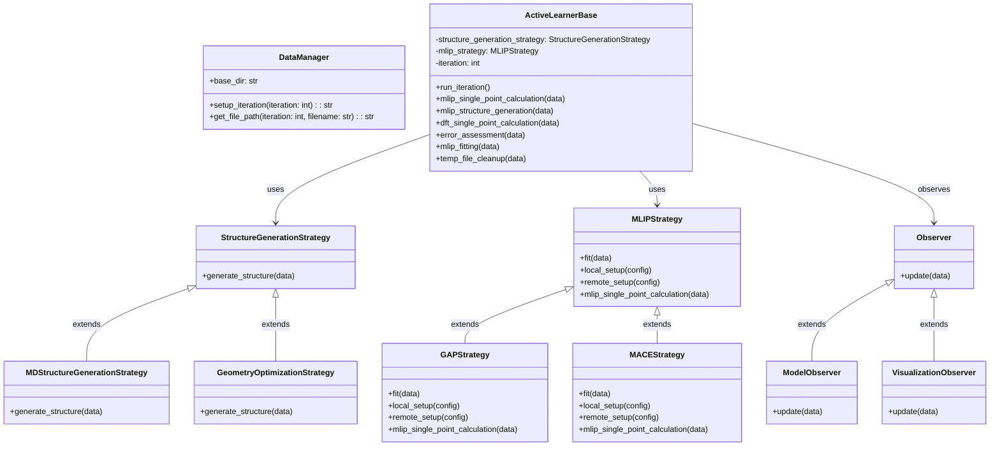

# mlipflow
> A succinct tagline explaining what it does.

## Table of Contents
- [Overview](#overview)
- [Installation](#installation)
- [Usage](#usage)
- [Features](#features)
- [Code Structure & Roadmap](#roadmap)
- [Contributing](#contributing)
- [Testing](#testing)
- [License](#license)
- [Contact](#contact)

## Overview
What and Why: Immediately explain the motivation behind the package. What problem does it solve? Why did you build it?
Audience: Briefly mention who the package is for—whether it’s meant for data scientists, web developers, or another niche.
Value Proposition: Emphasize what makes your implementation unique. This not only highlights your technical skill but also your design choices.

## Installation
Step-by-step instructions using code blocks.

## Usage
Code examples demonstrating primary functions and expected outcomes, including graphical outputs if applicable.

## Features
- Easy to use and extend
- Optimized for performance
- Comprehensive error handling

## Code Structure & Roadmap
### Code Structure
This package follows an object-oriented approach, with core classes interacting as follows:

### Roadmap
Planned improvements:
- ...

## Contributing
Guidelines for developers interested in contributing.

## Testing
Instructions for running tests and CI integration info.

## License
MIT License.

## Contact
Your email or professional social media links.
