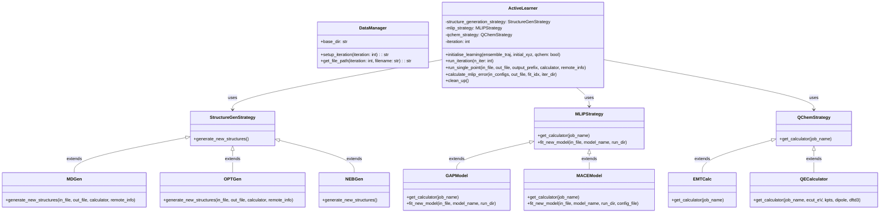

# mlipflow
**A Python Package for Reaction Pathway Exploration using Machine-Learned Interatomic Potentials (MLIPs)**

mlipflow bridges the critical gap between high-level machine learning development and practical catalysis research. It provides a modular, scalable framework to automate the exploration of complex reaction pathways with near-quantum accuracy at a fraction of the traditional computational cost.

>### 🚩 The Challenge: The "Catalysis Bottleneck"
>
>Traditional heterogeneous catalysis research faces three major hurdles that mlipflow is built to solve:
>
>The Cost-Accuracy Trade-off: Density Functional Theory (DFT) is the gold standard for accuracy but is too slow for exhaustive pathway exploration.
>
>Human Selection Bias: Researchers often manually "guess" reaction pathways, potentially missing the actual rate-determining steps or low-energy configurations.
>
>Architecture Lock-in: Most existing MLIP packages are tied to specific, often outdated, ML architectures. Transitioning to state-of-the-art models like MACE typically requires a complete rewrite of the simulation workflow.

## ✨ Key Features

Modularity: Built on ASE and LangGraph, allowing for modular extension of functions and custom calculators.

Scalability: Integrated with WFL to support seamless execution on HPC platforms, scaling from small tests to massive datasets.

Extensibility: Supports multiple strategies for structure generation (e.g., MD, optimization, NEB) and MLIP training (e.g., GAP, MACE)..

## 🔄 The Iterative Workflow

mlipflow employs an active learning loop to refine the Potential Energy Surface (PES):

Generate: Create new configurations (e.g., via MLIP-NEB) to explore unknown regions.

Compute: Automatically trigger high-level DFT (Quantum Espresso) for "ground truth" data.

Train: Update the MLIP model, refining its accuracy for the next iteration of exploration.

## Installation
```bash
$ git install https://github.com/Vespertili0/mlipflow.git
```

## Usage
Code examples demonstrating primary functions and expected outcomes, including graphical outputs if applicable.

## Features
- Easy to use and extend
- Optimized for performance
- Comprehensive error handling

## Code Structure & Roadmap
### Code Structure
This package follows an object-oriented approach, with core classes interacting as follows:



### Roadmap
Planned improvements:
- ...


## Contributing
Guidelines for developers interested in contributing.

## Testing
Instructions for running tests and CI integration info.

## License
MIT License.

## Contact
Your email or professional social media links.
