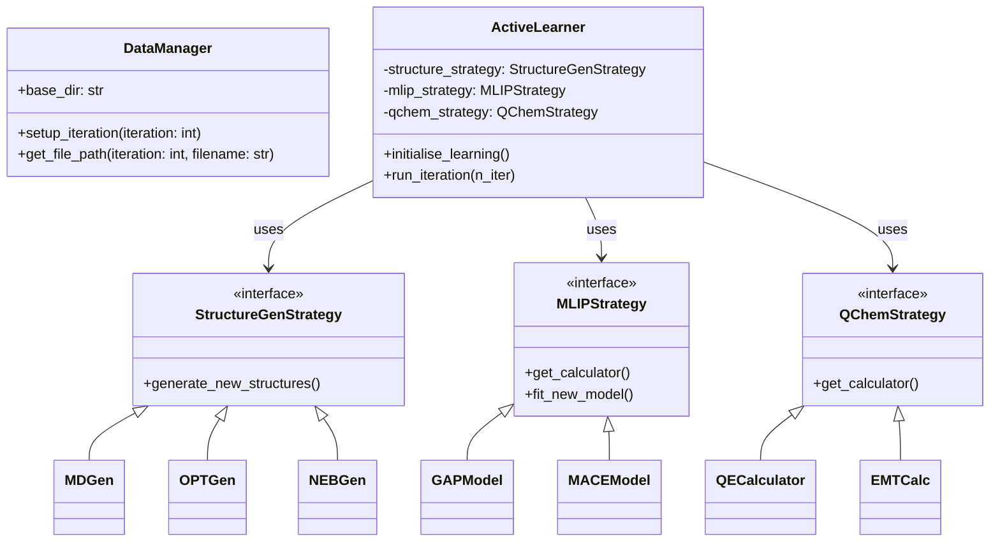

# mlipflow

[](https://github.com/Vespertili0/mlipflow/actions/workflows/tests.yaml)
[](https://github.com/Vespertili0/mlipflow)
[](https://opensource.org/licenses/MIT)
[](https://www.python.org/downloads/)
[](https://codecov.io/gh/Vespertili0/mlipflow)

**Automating Reaction Pathway Exploration with Machine-Learned Interatomic Potentials (MLIPs)**

`mlipflow` bridges the gap between high-level machine learning development and practical catalysis research. It provides a modular, scalable framework to automate the exploration of complex reaction pathways with near-quantum accuracy at a fraction of the computational cost, employing an active learning loop to refine the Potential Energy Surface (PES).

---

## 🚩 The Challenge: The "Catalysis Bottleneck"
Traditional heterogeneous catalysis research faces significant hurdles that `mlipflow` is built to solve:

*   **The Cost-Accuracy Trade-off:** Density Functional Theory (DFT) is the gold standard for accuracy but is computationally prohibitive for exhaustive pathway exploration.
*   **Human Selection Bias:** Researchers often manually "guess" reaction pathways, potentially missing rate-determining steps or low-energy configurations.
*   **Data Scarcity:** High-quality quantum chemical data is expensive to generate; `mlipflow` optimises data acquisition through active learning.

## ✨ Key Features
*   **Modular Architecture:** Built on [ASE](https://wiki.fysik.dtu.dk/ase/) and [LangGraph](https://github.com/langchain-ai/langgraph), allowing for seamless extension of calculators and workflow nodes.
*   **HPC Scalability:** Integrated with [WFL](https://github.com/libAtoms/workflow) for parallel execution on high-performance computing platforms.
*   **Multi-Model Support:** Native support for state-of-the-art MLIPs including **MACE** and **GAP**.
*   **Advanced Sampling:** Strategies for Molecular Dynamics (MD), Geometry Optimisation (OPT), and Nudged Elastic Band (NEB) structure generation.
*   **Smart Refinement:** GMM-based configuration selection to target high-uncertainty regions of the chemical space.

## 🔄 The Active Learning Workflow
`mlipflow` orchestrates a continuous loop to iteratively improve model accuracy:

1.  **Generate:** Create new configurations (via MD, OPT, or NEB) to explore unknown regions.
2.  **Compute:** Automatically trigger high-level DFT (Quantum ESPRESSO) for "ground truth" data on selected configurations.
3.  **Train:** Update the MLIP model, refining the PES for the next iteration.

## 🚀 Installation

Install `mlipflow` directly from GitHub:

```bash
pip install git+https://github.com/Vespertili0/mlipflow.git
```

For development installation:

```bash
git clone https://github.com/Vespertili0/mlipflow.git
cd mlipflow
pip install -e ".[dev]"
```

## 🛠️ Quick Start

```python
from mlipflow.core.active_learner import ActiveLearner
from mlipflow.strategies.mlip import MACEModel
from mlipflow.strategies.dft import QECalculator

# Initialise strategies
mlip = MACEModel(mlip_name="my_model", run_mode="local")
qchem = QECalculator(qe_prefix="DFT_")

# Set up the learner
learner = ActiveLearner(
    mlip_strategy=mlip,
    qchem_strategy=qchem,
    base_dir="./workdir"
)

# Run an iteration of active learning
learner.run_iteration(n_iter=1)
```

## Architecture



## 🧪 Testing
Run the test suite using `pytest`:

```bash
python -m pytest tests/
```

## 📄 License
This project is licensed under the MIT License - see the [LICENSE](LICENSE) file for details.
