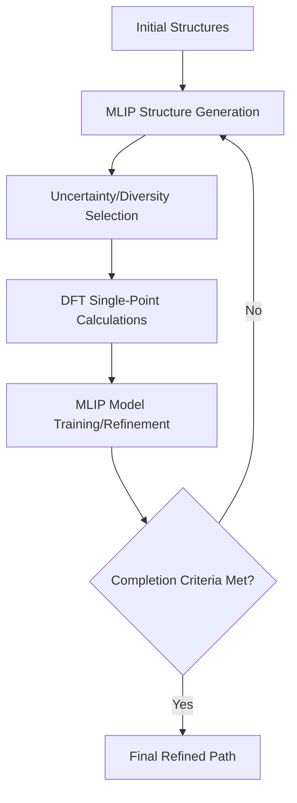

# Overview

## Purpose

The primary goal of `mlipflow` is to accelerate catalysis research by automating the discovery and refinement of reaction pathways. By leveraging Machine-Learned Interatomic Potentials (MLIPs), it allows for efficient exploration of the Potential Energy Surface (PES) while maintaining high accuracy through an active learning loop integrated with Density Functional Theory (DFT) calculations.

### 🚩 The Catalyst Research Bottleneck

1.  **Cost-Accuracy Trade-off**: DFT is accurate but slow.
2.  **Human Selection Bias**: Manual pathway selection can miss critical low-energy configurations.
3.  **Complexity**: High-dimensional reaction coordinates are difficult to explore manually.

## 🏗️ Architecture

`mlipflow` follows a modular, object-oriented design built on top of **ASE (Atomic Simulation Environment)**, **wfl (Workflow Library)**, and **LangGraph**.

### Core Components

-   **DataManager**: Handles file system organisation and iteration-based data storage.
-   **ActiveLearner**: Orchestrates the active learning loop (Generate -> Compute -> Train).
-   **Strategies**: Abstract interfaces for different calculation backends:
    -   `StructureGenStrategy`: Methods for generating new configurations (MD, OPT, NEB).
    -   `MLIPStrategy`: Support for various MLIP models (GAP, MACE).
    -   `QChemStrategy`: Integration with DFT codes (Quantum Espresso).
-   **GraphFlow**: Defines the workflow nodes and state management using LangGraph for complex, non-linear workflows.

### Workflow Diagram

## ✨ Key Features

-   **Modular Design**: Easily swap out MLIP models, DFT calculators, or generation strategies.
-   **Scalability**: Built for HPC environments with seamless integration via `wfl`.
-   **Active Learning**: Intelligent selection of new configurations to label, minimising expensive DFT calls.
-   **Advanced Sampling**: Supports Metadynamics, NVT/NPT MD, and NEB-based exploration.
-   **GMM Selection**: Uses Gaussian Mixture Models (GMM) for uncertainty-based configuration selection.
